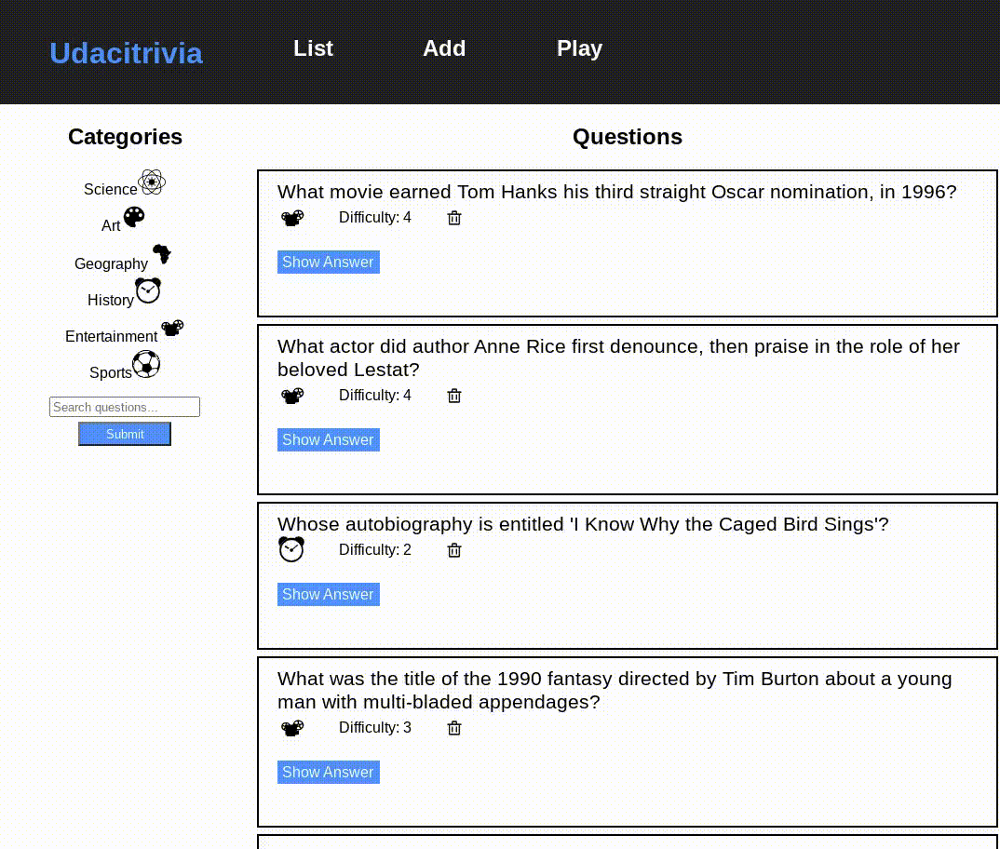

# Trivia Project

This project is a quiz game that test the player's knowledge of trivia questions. It has the following functionalities:

1. Display questions - both all questions and by category. Questions show the question, category and difficulty rating by default and can show/hide the answer.
2. Delete questions.
3. Add questions and require that they include question and answer text.
4. Search for questions based on a text query string.
5. Play the quiz game, randomizing either all questions or within a specific category.



## Getting Started

### Prerequisites

Developers using this project should have the following already installed.

- Python3
- pip
- node
- npm

## Installing Dependencies

### Fontend Dependencies

1. This project uses NPM to manage software dependencies. NPM Relies on the package.json file located in the `frontend` directory of this repository. After cloning, open your terminal, navigate to the `/frontend` and run:

```bash
npm install
```

### Backend Dependencies

**PIP Dependencies** - Once your virtual environment is setup and running, install the required dependencies by navigating to the `/backend` directory and running:

```bash
pip install -r requirements.txt
```

## Running the Frontend in Dev Mode

---

The frontend app was built using create-react-app. In order to run the app in development mode use `npm start`. You can change the script in the `package.json` file.

Open [http://localhost:3000](http://localhost:3000) to view it in the browser. The page will reload if you make edits.

```bash
npm start
```

If you get an error due to the old version of react used, fix it by running

```bash
export NODE_OPTIONS=--openssl-legacy-provider && yarn build && yarn install --production --ignore-scripts --prefer-offline
```

## Setting up the Database

---

With Postgres running, create a `trivia` database:

```bash
createbd trivia
```

Populate the database using the `trivia.psql` file provided. From the `backend` folder in terminal run:

```bash
psql trivia < trivia.psql
```

### Setting up environment variables for database

1. In the `/backend` directory, create a file named `.env`
2. Open the `.env` file in your IDE
3. Copy the content of env_example into the `.env` file.
4. Provide the database username and database password

```
DB_USERNAME = "my_db_username"
DB_PASSWORD = "my_db_password"
```

## Running the Server

---

From within the `/backend` directory first ensure you are working using your created virtual environment.

To run the server, execute:

```bash
export FLASK_APP=flaskr
export FLASK_ENV=development
flask run
```

## Testing

---

```bash
dropdb trivia_test
createdb trivia_test
psql trivia_test < trivia.psql
python test_flaskr.py
```

Omit the dropdb command the first time you run tests.

## API Reference

---

### Getting Started

Base URL: Currently this application is only hosted locally. The backend is hosted at http://127.0.0.1:5000/

Authentication: This version does not require authentication or API keys.

### Error handling

Errors are returned as JSON in the following format:

```json
{
    "success": False,
    "error": 404,
    "message": "resource not found"
}
```

The API will return three types of errors:

- 400 – bad request
- 404 – resource not found
- 422 – unprocessable

### Endpoints

`GET '/categories'`

- Fetches a dictionary of questions in which the keys are the ids and the value is the corresponding string of the category
- Request Arguments: None
- Returns: An object with a single key, `categories`, that contains an object of `id: category_string` key: value pairs.

Sample request via `curl`:

```
curl http://127.0.0.1:5000/categories
```

Response

```json
{
	"categories": {
		"1": "Science",
		"2": "Art",
		"3": "Geography",
		"4": "History",
		"5": "Entertainment",
		"6": "Sports"
	},
	"success": true
}
```

`GET '/questions'`

- Fetches questions paginated in group of 10 questions per page
- Request Arguments: page number starting from 1
- Returns: A list of questions, number of total questions, current category, categories.

Sample request via `curl`:

```
curl http://127.0.0.1:5000/questions
```

Response

```json
{
	"categories": {
		"1": "Science",
		"2": "Art",
		"3": "Geography",
		"4": "History",
		"5": "Entertainment",
		"6": "Sports"
	},
	"current_category": null,
	"len_question": 10,
	"questions": [
		{
			"answer": "Apollo 13",
			"category": 5,
			"difficulty": 4,
			"id": 2,
			"question": "What movie earned Tom Hanks his third straight Oscar nomination, in 1996?"
		},
		{
			"answer": "Tom Cruise",
			"category": 5,
			"difficulty": 4,
			"id": 4,
			"question": "What actor did author Anne Rice first denounce, then praise in the role of her beloved Lestat?"
		},
		{
			"answer": "Maya Angelou",
			"category": 4,
			"difficulty": 2,
			"id": 5,
			"question": "Whose autobiography is entitled 'I Know Why the Caged Bird Sings'?"
		},
		{
			"answer": "Edward Scissorhands",
			"category": 5,
			"difficulty": 3,
			"id": 6,
			"question": "What was the title of the 1990 fantasy directed by Tim Burton about a young man with multi-bladed appendages?"
		},
		{
			"answer": "Brazil",
			"category": 6,
			"difficulty": 3,
			"id": 10,
			"question": "Which is the only team to play in every soccer World Cup tournament?"
		},
		{
			"answer": "Uruguay",
			"category": 6,
			"difficulty": 4,
			"id": 11,
			"question": "Which country won the first ever soccer World Cup in 1930?"
		},
		{
			"answer": "George Washington Carver",
			"category": 4,
			"difficulty": 2,
			"id": 12,
			"question": "Who invented Peanut Butter?"
		},
		{
			"answer": "Lake Victoria",
			"category": 3,
			"difficulty": 2,
			"id": 13,
			"question": "What is the largest lake in Africa?"
		},
		{
			"answer": "The Palace of Versailles",
			"category": 3,
			"difficulty": 3,
			"id": 14,
			"question": "In which royal palace would you find the Hall of Mirrors?"
		},
		{
			"answer": "Agra",
			"category": 3,
			"difficulty": 2,
			"id": 15,
			"question": "The Taj Mahal is located in which Indian city?"
		}
	],
	"success": true,
	"total_questions": 23
}
```

`DELETE '/questions/<int:question_id>'`

- `DELETE` a question using a question `ID`
- Request Arguments: question `ID`
- Returns: `ID` of question that was deleted and the remaining paginated questions

Sample request via `curl`:

```
curl -X DELETE http://127.0.0.1:5000/questions/23
```

Response

```json
{
	"deleted": 23,
	"questions": [
		{
			"answer": "Apollo 13",
			"category": 5,
			"difficulty": 4,
			"id": 2,
			"question": "What movie earned Tom Hanks his third straight Oscar nomination, in 1996?"
		},
		{
			"answer": "Tom Cruise",
			"category": 5,
			"difficulty": 4,
			"id": 4,
			"question": "What actor did author Anne Rice first denounce, then praise in the role of her beloved Lestat?"
		},
		{
			"answer": "Maya Angelou",
			"category": 4,
			"difficulty": 2,
			"id": 5,
			"question": "Whose autobiography is entitled 'I Know Why the Caged Bird Sings'?"
		},
		{
			"answer": "Edward Scissorhands",
			"category": 5,
			"difficulty": 3,
			"id": 6,
			"question": "What was the title of the 1990 fantasy directed by Tim Burton about a young man with multi-bladed appendages?"
		},
		{
			"answer": "Brazil",
			"category": 6,
			"difficulty": 3,
			"id": 10,
			"question": "Which is the only team to play in every soccer World Cup tournament?"
		},
		{
			"answer": "Uruguay",
			"category": 6,
			"difficulty": 4,
			"id": 11,
			"question": "Which country won the first ever soccer World Cup in 1930?"
		},
		{
			"answer": "George Washington Carver",
			"category": 4,
			"difficulty": 2,
			"id": 12,
			"question": "Who invented Peanut Butter?"
		},
		{
			"answer": "Lake Victoria",
			"category": 3,
			"difficulty": 2,
			"id": 13,
			"question": "What is the largest lake in Africa?"
		},
		{
			"answer": "The Palace of Versailles",
			"category": 3,
			"difficulty": 3,
			"id": 14,
			"question": "In which royal palace would you find the Hall of Mirrors?"
		},
		{
			"answer": "Agra",
			"category": 3,
			"difficulty": 2,
			"id": 15,
			"question": "The Taj Mahal is located in which Indian city?"
		}
	],
	"success": true,
	"total_questions": 22
}
```

`POST '/questions'`

Perform two functions:

1. Searches for questions

   - Fetch questions based on a search term. It should return .
   - Request Arguments: search term
   - Returns: Any questions for whom the search term is a substring of the question

   Sample request via `curl`:

   ```
   curl -X POST http://127.0.0.1:5000/questions -H "Content-Type: application/json" -d '{"searchTerm": "who is the"}'

   ```

   Response

   ```json
   {
   	"categories": {
   		"1": "Science",
   		"2": "Art",
   		"3": "Geography",
   		"4": "History",
   		"5": "Entertainment",
   		"6": "Sports"
   	},
   	"current_category": null,
   	"questions": [
   		{
   			"answer": "Delali Jean-Pierre Dogbevi",
   			"category": 4,
   			"difficulty": 1,
   			"id": 25,
   			"question": "Who is the best programmer of all time"
   		},
   		{
   			"answer": "You watching this video",
   			"category": 4,
   			"difficulty": 5,
   			"id": 47,
   			"question": "Who is the best in the world"
   		}
   	],
   	"success": true,
   	"total_questions": 22
   }
   ```

2. Create new question

   - Creates a new question, which will require the details of the new question (question and answer text, category, and difficulty score.)
   - Request Arguments: None
   - Returns: JSON object with newly created question, and paginated questions.

   Sample request via `curl`:

```
curl -X POST http://127.0.0.1:5000/questions -H "Content-Type: application/json" -d '{"question": "When did Ghana gain independence?", "answer": "March 6th 1957","difficulty": 3, "category": 4}'

```

Response

```json
{
	"created": 50,
	"questions": [
		{
			"answer": "Apollo 13",
			"category": 5,
			"difficulty": 4,
			"id": 2,
			"question": "What movie earned Tom Hanks his third straight Oscar nomination, in 1996?"
		},
		{
			"answer": "Tom Cruise",
			"category": 5,
			"difficulty": 4,
			"id": 4,
			"question": "What actor did author Anne Rice first denounce, then praise in the role of her beloved Lestat?"
		},
		{
			"answer": "Maya Angelou",
			"category": 4,
			"difficulty": 2,
			"id": 5,
			"question": "Whose autobiography is entitled 'I Know Why the Caged Bird Sings'?"
		},
		{
			"answer": "Edward Scissorhands",
			"category": 5,
			"difficulty": 3,
			"id": 6,
			"question": "What was the title of the 1990 fantasy directed by Tim Burton about a young man with multi-bladed appendages?"
		},
		{
			"answer": "Brazil",
			"category": 6,
			"difficulty": 3,
			"id": 10,
			"question": "Which is the only team to play in every soccer World Cup tournament?"
		},
		{
			"answer": "Uruguay",
			"category": 6,
			"difficulty": 4,
			"id": 11,
			"question": "Which country won the first ever soccer World Cup in 1930?"
		},
		{
			"answer": "George Washington Carver",
			"category": 4,
			"difficulty": 2,
			"id": 12,
			"question": "Who invented Peanut Butter?"
		},
		{
			"answer": "Lake Victoria",
			"category": 3,
			"difficulty": 2,
			"id": 13,
			"question": "What is the largest lake in Africa?"
		},
		{
			"answer": "The Palace of Versailles",
			"category": 3,
			"difficulty": 3,
			"id": 14,
			"question": "In which royal palace would you find the Hall of Mirrors?"
		},
		{
			"answer": "Agra",
			"category": 3,
			"difficulty": 2,
			"id": 15,
			"question": "The Taj Mahal is located in which Indian city?"
		}
	],
	"success": true,
	"total_questions": 23
}
```

`GET '/categories/<int:category_id>/questions'`

- Fetches questions based on category.
- Request Arguments: `ID` of the category
- Returns: A list of questions, number of total questions, current category, categories in a selected category.

Sample request via `curl`:

```

curl http://127.0.0.1:5000/categories/1/questions

```

Response

```

{
"current_category": "Science",
"questions": [
{
"answer": "The Liver",
"category": 1,
"difficulty": 4,
"id": 20,
"question": "What is the heaviest organ in the human body?"
},
{
"answer": "Alexander Fleming",
"category": 1,
"difficulty": 3,
"id": 21,
"question": "Who discovered penicillin?"
},
{
"answer": "Blood",
"category": 1,
"difficulty": 4,
"id": 22,
"question": "Hematology is a branch of medicine involving the study of what?"
}
],
"success": true,
"total_questions": 3
}

```

`POST '/quizzes'`

- Fetches questions to play the quiz. It takes a category and previous question parameters.
- Request Arguments: None
- Returns: A random questions within the given category, if provided, and that is not one of the previous questions.

Sample request via `curl`:

```

curl http://127.0.0.1:5000/quizzes -X POST -H "Content-Type: application/json" -d '{"previous_questions": [1,2], "quiz_category": {"type": "Science", "id": "1"}}'

```

Response

```json
{
	"previous_questions": [1, 2],
	"question": {
		"answer": "The Liver",
		"category": 1,
		"difficulty": 4,
		"id": 20,
		"question": "What is the heaviest organ in the human body?"
	},
	"success": true
}
```

## Authors

---

Alex Sandberg-Bernard authored the API (`__init__.py`), test suite (`test_flaskr.py`), and this README.<br>
All other project files, including the models and frontend, were created by [Udacity](https://www.udacity.com/) as a project template for the [Full Stack Web Developer Nanodegree](https://www.udacity.com/course/full-stack-web-developer-nanodegree--nd0044).
